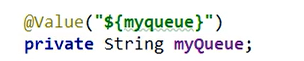
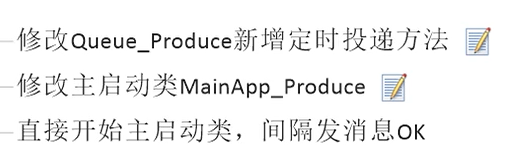

# ActiveMQ

两种模式：一对一、一对多

良好的编码习惯，url地址定义一个常量，方便修改

消费者消费带有负载均衡的思想，一半一半消费

使用ActiveMQ，使用JmsTemplate模板

基础入门部分，mq需要创建连接池等等，跟数据库连接类似

@Value   @Component

MQ定时发送消息：触发投递、间隔定投

使用nio协议代替tcp协议，进行性能调优

ActiveMQ传输协议之NIO

