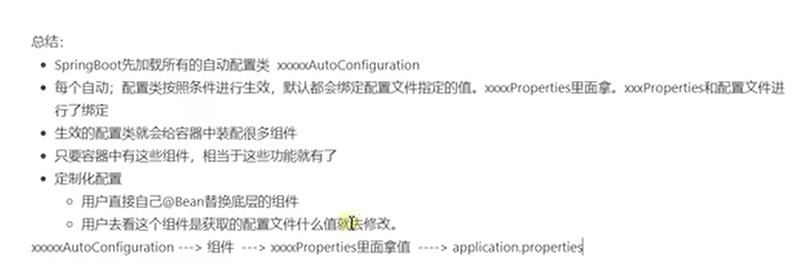
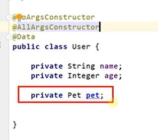
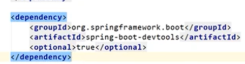
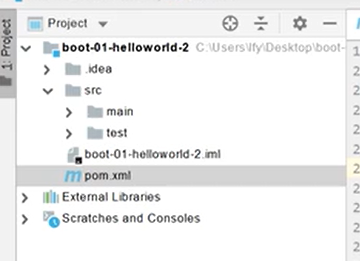

## day01

##### 1、依赖管理

##### 2、自动配置特性

@Configuration  配置类注解

##### 3、各种注解如何使用

详情查看老师视频

什么是响应式编程？

 “响应式编程(Reactive Programming 或称反应式编程)是一种流行的编程方法,编写代码是基于对变化的反应。它的灵感来自于我们的日常生活,也即我们如何采取行动以及与他人沟通。 

常用于电商项目中付款结算的实现。

##### 4、Spring Boot配置流程

##### 5、开发小技巧

*  lombak

* Developer Toolds 热更新  ctrl+F9  实时生效，不用重新启动项目，可以节约时间

* Spring Initailizr  项目初始化向导

有选择性的引入依赖，把项目结构创建好

没用的文件可以删掉

##### 6、SpringBoot的核心功能

（1）使用yml配置文件，能更加直观的看到配置信息

（2）使用SpringBoot进行Web开发

##### 7、Web开发

默认是resources文件夹下都是静态文件，可以在yaml文件中进行相关访问的设置

静态资源配置原理(底层)

雷神讲课会分析源码，比较难理解

请求映射使用@RequestMapping注解， 通过请求地址来处理请求。

使用请求方式来区分这些请求。

Spring Boot的底层还是用到Spring MVC,即DispatcherServlet

