## day01

##### 1、依赖管理

##### 2、自动配置特性

@Configuration  配置类注解

##### 3、各种注解如何使用

详情查看老师视频

什么是响应式编程？

 “响应式编程(Reactive Programming 或称反应式编程)是一种流行的编程方法,编写代码是基于对变化的反应。它的灵感来自于我们的日常生活,也即我们如何采取行动以及与他人沟通。 

常用于电商项目中付款结算的实现。

##### 4、Spring Boot配置流程

##### 5、开发小技巧

*  lombak

* Developer Toolds 热更新  ctrl+F9  实时生效，不用重新启动项目，可以节约时间

* Spring Initailizr  项目初始化向导

有选择性的引入依赖，把项目结构创建好

没用的文件可以删掉

##### 6、SpringBoot的核心功能

（1）使用yml配置文件，能更加直观的看到配置信息

（2）使用SpringBoot进行Web开发

##### 7、Web开发

默认是resources文件夹下都是静态文件，可以在yaml文件中进行相关访问的设置

静态资源配置原理(底层)

雷神讲课会分析源码，比较难理解

请求映射使用@RequestMapping注解， 通过请求地址来处理请求。

使用请求方式来区分这些请求。

Spring Boot的底层还是用到Spring MVC,即DispatcherServlet

请求映射原理解析

@RequestAttribute注解，获取到request中的值

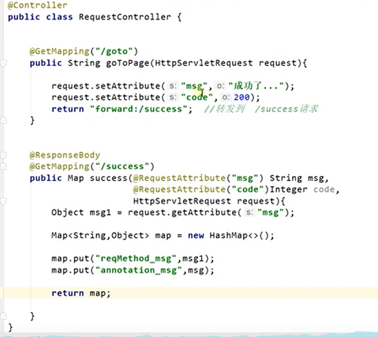

@MatrixVarible  矩阵变量

##### 8、各种类型参数解析方法

map、model里的数据会被放到request请求域中，都相当于给request放数据

自定义对象参数的封装过程和原理

@GetMapping   @PostMapping

自定义数据绑定的原理

自定义Converter原理

##### 9、ModelAndView 返回视图对象

##### 10、MessageConverter的原理

通过MessageConverter把对象转为JSON

内容协商：找到合适的Converter处理这个对象，转换成JSON输出

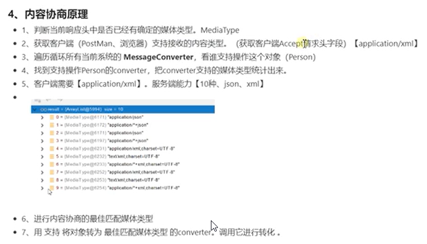

**基于请求头的内容协商原理**

使用postman可以很好的定义请求头

**基于请求参数的内容协商原理**

允许自定义内容协商管理器

##### 11、过滤器与拦截器的配置

Spring开发过程中注入Web原生组件

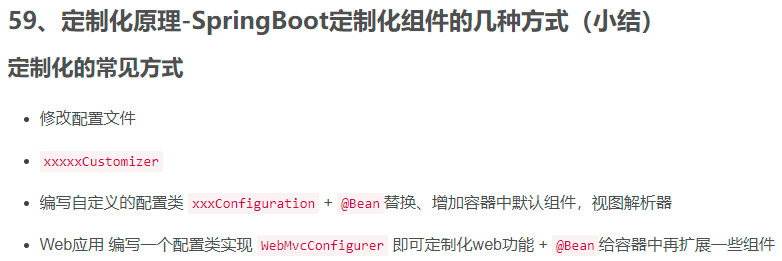

自定义配置，定制Web功能    @Bean给容器中扩展功能

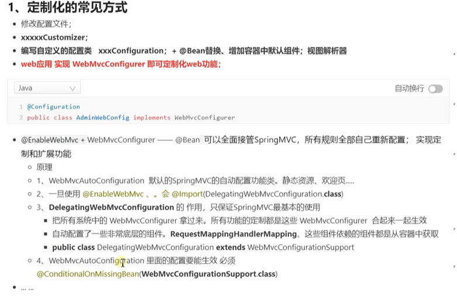

##### 12、引入阿里Druid数据源

Druid具有监控功能，可以查看sql语句的执行状态。并且监控功能页面可以设置用户名和密码

##### 13、SpringBoot整合MyBatis

MyBatis可以不写全局配置文件，相关配置项写在application.yml即可

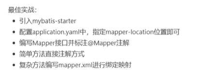

使用MyBatis-Plus进行快速开发

Plus的sql映射文件放在类路径的mapper文件夹下，为xxxMapper.xml

直接使用Plus的方法进行开发即可

Mapper继承BaseMapper，就可以使用已经声明好的增删改查方法，基础mapper是有的。除非特别复杂的增删改查，需要自己编写映射文件编写

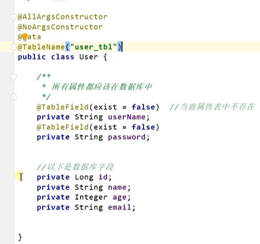

数据库表名修改的规范

代码中存储页面上的对象是Model，可以在页面上取出数据并展示

分页查询使用wrapper对象

Page对象直接使用MyBatis Plus中的对象即可

page一系列的属性展示出来

##### 14、Redis非关系型数据库

Jedis用来操作Redis的客户端

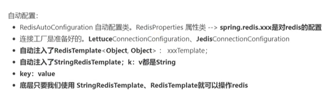

阿里云按量付费的redis，并进行相关环境搭配

##### 15、单元测试JUnit5的变化

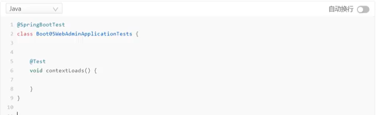

只需引入两个注解，即可使用单元测试

@Test注解使用的比较多

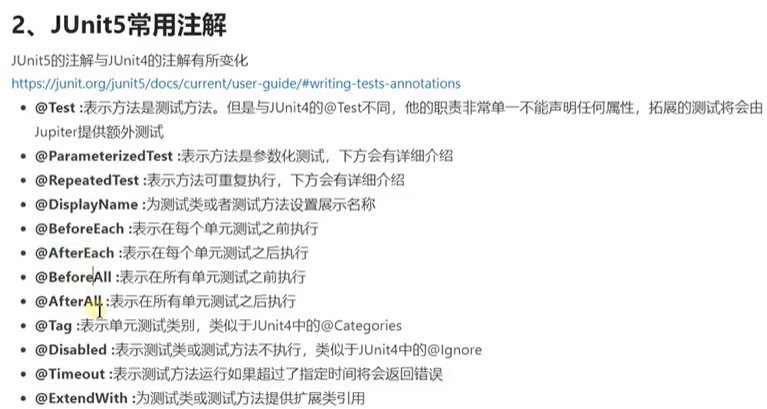

BeforeAll只执行一次，BeforeEach每次测试都会执行

assertions断言机制：检查业务逻辑返回的数据是否合理

前置条件assumptions：不满足某个条件使测试终止

参数化测试：使用不同的参数进行多次测试

JUnit4的许多注解都被替代了，JUnit的完整功能查照官方文档学习

##### 16、指标监控功能  SpringBoot Actuator

每个微服务可获得生产级别的应用监控、审计等功能

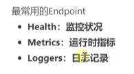

指标监控：定制endpoint         在配置文件中暴露自己的端点

整合  spring boot admin,引入一个依赖，就可以直接进入后台查看程序的运行状态，组件信息、线程数、健康状况等等信息都可以看到

##### 17、SpringBoot高级特性

(1)profile功能

生产、测试、开发激活环境：配置文件配置、命令行配置

标在方法上，指定的环境这个方法才会生效

(2)配置项加载优先级

(3)自定义starter

SpringBoot的完整启动过程分析

SpringBoot容器中实例化所有可能需要用到的组件，这样写代码时直接使用@Autowired注解即可使用

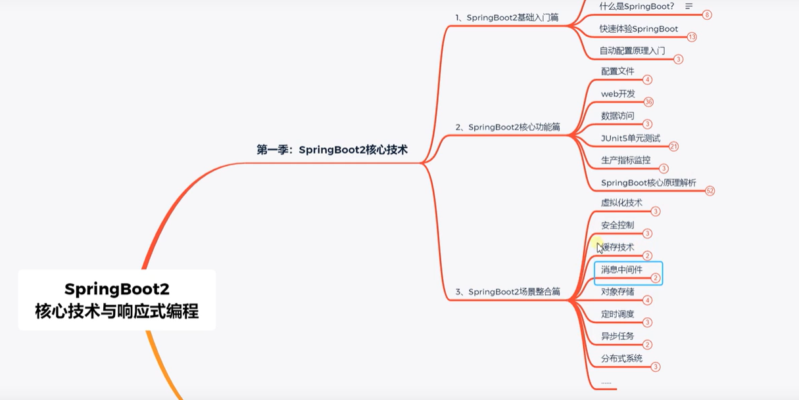

