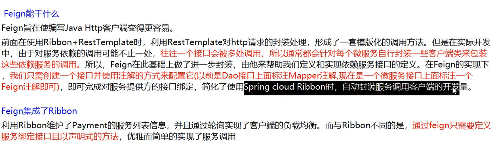
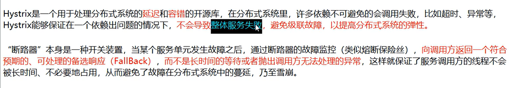
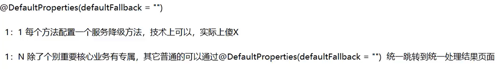

### 1、SpringCloud相关知识点

@Configuration+@Bean注解，将第三方的对象注入到容器中，之后就可以通过@Autowired注入

controller层增加数据，传入对象需要加@RequestBody注解，才能正常添加数据到数据库

工程重构：系统中有重复部分，entity中的实体类对象不需要每个微服务中都写

服务之间通过RestTemplate进行test风格的互相调用

### 2、Eureka服务注册中心

Eureka服务注册中心、服务提供者、消费者之间是一个三角形的结构

Eureka端口7001  Consumer80   Provider8001

Eureka注册中心(server)、服务提供者(client)的mainboot上都要加上eureka的注解

eureka集群：互相注册，保证高可用

Eureka7001、Eureka7002，修改映射host文件。服务端的实例名称需要设置不同

@Value可以从yml配置文件中获取到值

使用@LoadBalanced注解赋予RestTemplate负载均衡的能力，使服务集群高可用

之后介绍的Ribbon负载均衡也能实现轮询

Eureka自我保护：某时刻一个微服务不可用，Eureka不会立刻清理，依旧会对该微服务信息进行保存。防止因网络故障，导致误删除微服务

关闭自我保护，微服务故障，立即删除微服务

### 3、Zookeeper服务注册中心

SpringCloud整合Zookeeper替代Eureka

Zookeeper服务提供者加上@EnableDiscoveryClient注解

@RequestMapping url地址请求访问

zookeeper是临时节点

public static final String 进行常量命名，变量名为大写

### 4、Consul服务注册中心

服务提供者、消费者注册进consul

CAP

C：强一致性   A：可用性   P：分区容错性

AP(Eureka)   淘宝首先保证高可用性，而不是强一致性

ZP(Zookeeper/Consul)

### 5、Ribbon负载均衡

Ribbon=负载均衡+RestTemplate

轮询负载均衡算法原理：次数取模   CAS+自旋锁

### 6、OpenFeign服务调用

Feign已被OpenFeign取代

OpenFeign=接口+注解

@EnableFeignClient  激活并开启服务调用    在业务类接口上还要加FeignClient注解

OpenFeign根据业务设置超时时间，默认处理业务的时间是1s。超过处理时间就会报错

OpenFeign日志打印功能，打印debug级别日志，日志非常详细

### 7、Hystrix服务降级

多个微服务之间调用，如果某个服务出现问题，就会发生服务雪崩

作用：服务降低、服务熔断、接近实时的监控

**降级：服务器忙，请稍后再试，超过业务设置处理时间**

**熔断：因为服务挂了，告诉你服务不可用，请稍后再试。当检测到服务正常后，慢慢恢复接口使用**

限流：解决秒杀高并发等操作，使用Alibaba Sential进行讲解

Jmeter压测后卡顿，使用Hystrix容错降级解决

熔断降级，保证系统的高可用性，防止CPU被占满

业务多少秒以内算健康，否则就报错

服务降级通用的和独享的各自分开，方便管理

Hutool 糊涂工具包，唯一ID生成工具，字符串工具，使用起来方便

引入pom依赖包，即可搭建Hystrix Dashboard的端口9001图形化监控平台。主启动类还需加入代码和注解，才能使用界面

